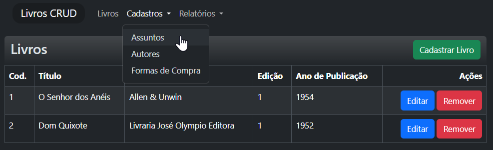

# Livros CRUD em .NET and Angular



# Comandos úteis

Executar testes: `cd api/Livros.Tests && ASPNETCORE_ENVIRONMENT=Development dotnet watch test`

Executar backend: `cd api && ASPNETCORE_ENVIRONMENT=Development dotnet watch --project Livros.API`

Executar frontend: `cd app && ng serve`

---

# Passos que realizei para criar o backend

## Extensões recomendadas do VS Code

- C# Dev kit: https://marketplace.visualstudio.com/items?itemName=ms-dotnettools.csdevkit
- IntelliCode for C# Dev Kit: https://marketplace.visualstudio.com/items?itemName=ms-dotnettools.vscodeintellicode-csharp

## Incializar git no projeto

`git init --initial-branch=main`

`git config user.name "Bruno Cassol"`

`git config user.email "brunocassol+ww9@gmail.com"`

## Configuração de ambiente Ubuntu 20.04 em WSL2

Instalar repositorio de pacotes da Microsoft no Ubuntu:

`cd ~ && curl -sSL -O https://packages.microsoft.com/config/ubuntu/20.04/packages-microsoft-prod.deb`

`sudo dpkg -i packages-microsoft-prod.deb`

`rm packages-microsoft-prod.deb`

Instalar .NET 9:

`sudo apt-get update && sudo apt-get install -y dotnet-sdk-9.0`

Adicionar certificados para TLS local:

`dotnet dev-certs https --trust`

# Criar projeto .NET para API

Criar pasta para api:
`mkdir api && cd api`

Atualizar lista de workloads:
`dotnet workload update`

Listar templates:
`dotnet new list`

Listar opções para template Web API:
`dotnet new webapi --help`

Criar projeto com as opções desejadas:

`dotnet new webapi --language C# --auth None --framework net9.0 --use-controllers --name Livros.API`

Criar arquivo .gitignore com dotnet CLI:

`dotnet new gitignore`

Anotações até aqui:

- O arquivo `Properties/launchSettings.json` é utilizado pelo Visual Studio porém não funciona com o VS Code.
  - Devemos então criar um arquivo `.vscode/launchSettings.json` com o conteúdo similar ao arquivo `Properties/launchSettings.json`.
- O comando criou um entidade `WeatherForecast.cs` na raiz do projeto. Mas iremos armazenar entidades em outro projeto chamado Livros.Data que será criado posteriormente.
- Por padrão o arquivo appsettings.Development.json será comitado. Devemos excluir este arquivo do controle de versão pois deve ser usado apenas para desenvolvimento local e varia entre desenvolvedores.
  - .NET escolhe qual arquivo appsettings usar baseado na variável de ambiente ASPNETCORE_ENVIRONMENT. Se ela estiver setada como "Development" então o arquivo appsettings.Development.json será carregado e poderá sobrescrever valores do arquivo `appsettings.json`.

Excluir `appsettings.Development.json` do controle de versão:

`echo "appsettings.Development.json" >> .gitignore`

Comitar estrutura inicial do projeto:

`git add .`

`git commit -m "feat: Estrutura inicial do api criado por: dotnet new webapi --language C# --auth None --framework net9.0 --use-controllers --name Livros.API"`

Rodar projeto para testar:

`dotnet watch`

Abrir http://localhost:5225/WeatherForecast

# Criar projeto Livros.Data

Agora vamos começar a reorganizar os arquivos em diferentes projetos .NET:

- Livros.API (atual, responde HTTPs)
- Livros.Data (entidades, contexto de banco de dados e migrations)
- Livros.Reports (relatórios)
- Livros.Tests (testes unitários)

Poderíamos ter também um projeto "Livros.Domain" porém para simplificar vamos agrupar no projeto Livros.Data.

Criar projeto Livros.Data:

`cd ..` para voltar para a pasta raiz do projeto .NET.

`dotnet new classlib --language C# --framework net9.0 --name Livros.Data`

`cd Livros.Data`

`dotnet new gitignore`

Apagar arquivo `Class1.cs` pois não será utilizado:

`rm Class1.cs`

Comitar estrutura inicial do projeto Livros.Data:

`git add .`

`git commit -m "feat: Estrutura inicial do projeto Livros.Data criado por: dotnet new classlib --language C# --framework net9.0 --name Livros.Data"`

Mover arquivo WeatherForecast.cs para uma nova pasta Entities do projeto Livros.Data:

`mkdir Entities`

`mv ../Livros.API/WeatherForecast.cs ./Entities/`

Alterar namespace de WeatherForecast.cs para Livros.Data:

`sed -i 's/Livros.API/Livros.Data.Entities/g' Entities/WeatherForecast.cs`

Adicionar projeto Livros.Data como referência no projeto Livros.API:

`cd ../Livros.API`

`dotnet add reference ../Livros.Data/Livros.Data.csproj`

Mover arquivo `/angular-net-livros.sln` para `/api/api.sln`:

`mv angular-net-livros.sln api/api.sln`

Editar o arquivo `api/api.sln` e alterar o caminho do projeto Livros.API para `Livros.API/Livros.API.csproj` e o caminho do projeto Livros.Data para `Livros.Data/Livros.Data.csproj`.

Corrigir namespace de WeatherForecast.cs no aruqivo do controller WeatherForecastController.cs adicionando `using Livros.Data.Entities;`.

Rodar solução com watch:

`cd api`

`dotnet watch --project Livros.API`

Abrir http://localhost:5225/WeatherForecast

Pronto agora temos nossas entidades em um projeto separado e referenciado no projeto da API.

# Passar lógica da controler para o projeto Livros.Data

É preferível encapsular lógica de negócio em classes e funções que podem ser testadas unitariamente e reutilizadas em outros lugares.

Vamos criar uma pasta Services no projeto Livros.Data para abrigar a lógica de negócio.

`mkdir Services`

`touch Services/WeatherForecastService.cs`

Adicionar a classe WeatherForecastService.cs para que contenha um function que retorne uma lista de WeatherForecast conforme o código encontrado originalmente na Controller WeatherForecastController.cs.

Trecho relevante:

```csharp
Enumerable.Range(1, 5).Select(index => new WeatherForecast
        {
            Date = DateOnly.FromDateTime(DateTime.Now.AddDays(index)),
            TemperatureC = Random.Shared.Next(-20, 55),
            Summary = Summaries[Random.Shared.Next(Summaries.Length)]
        })
        .ToArray();

```

O código do arquivo WeatherForecastService.cs ficará assim:

```csharp
using Livros.Data.Entities;

namespace Livros.Data.Services;

public class WeatherForecastService
{
	private static readonly string[] Summaries = ["Freezing", "Bracing", "Chilly", "Cool", "Mild", "Warm", "Balmy", "Hot", "Sweltering", "Scorching"];

	public IEnumerable<WeatherForecast> GetWeatherForecasts()
	{
		return Enumerable.Range(1, 5).Select(index => new WeatherForecast
		{
			Date = DateOnly.FromDateTime(DateTime.Now.AddDays(index)),
			TemperatureC = Random.Shared.Next(-20, 55),
			Summary = Summaries[Random.Shared.Next(Summaries.Length)]
		}).ToArray();
	}
}
```

Crie uma interface IWeatherForecastService.cs para que possamos injetar a dependência de WeatherForecastService em outras classes.

`touch Services/IWeatherForecastService.cs`

O conteúdo do arquivo IWeatherForecastService.cs será:

```csharp
using Livros.Data.Entities;

namespace Livros.Data.Services;

public interface IWeatherForecastService
{
	IEnumerable<WeatherForecast> GetWeatherForecasts();
}
```

Configure injeção de depedência dinâmica de Services na API editando o arquivo Program.cs do projeto Livros.API:

```csharp
var builder = WebApplication.CreateBuilder(args);

// Configura injeção de depedência dinâmica de Services
var servicesAssembly = typeof(Livros.Data.Services.IWeatherForecastService).Assembly;
Console.WriteLine("Configurando Services para DI do projeto Livros.Data: " + servicesAssembly.FullName);
foreach (var type in servicesAssembly.GetTypes()
    .Where(t => t.Namespace == "Livros.Data.Services" && t.IsClass && !t.IsAbstract))
{
    var serviceInterface = type.GetInterfaces().FirstOrDefault();
    if (serviceInterface != null)
    {
        builder.Services.AddScoped(serviceInterface, type);
        Console.WriteLine("Service registrado dinamicamente: " + serviceInterface.Name);
    }
}
```

Altere o controller em WeatherForecastController.cs para chamar o serviço WeatherForecastService:

```csharp
using Microsoft.AspNetCore.Mvc;
using Livros.Data.Services;

namespace Livros.API.Controllers;

[ApiController]
[Route("[controller]")]
public class WeatherForecastController : ControllerBase
{
    private readonly IWeatherForecastService _weatherForecastService;

    public WeatherForecastController(IWeatherForecastService weatherForecastService)
    {
        _weatherForecastService = weatherForecastService;
    }

    [HttpGet]
    public IActionResult Get()
    {
        var forecasts = _weatherForecastService.GetWeatherForecasts();
        return Ok(forecasts);
    }
}

```

A API deve contrinuar functionando na URL http://localhost:5225/WeatherForecast

Comitar alterações:

`cd ../..`

`git add .`

`git commit -m "feat: Lógica de negócio movida para Livros.Data com injeção de dependência de Services"`

# Criar projeto Livros.Tests com xUnit

Agora que temos a API funcionando com lógica de negócio em um projeto separado, vamos criar testes unitários para garantir que a lógica de negócio está funcionando corretamente.

Quando formos implementar a lógica de negócio de verdade, poderemos escrever os testes primeiro seguindo a metodologia TDD (Test Driven Development).

Vamos criar um projeto de testes unitários com xUnit:

`cd api`

`dotnet new xunit --language C# --framework net9.0 --name Livros.Tests`

`cd Livros.Tests`

`dotnet new gitignore`

Adicionar projeto de Tests na solution:

`cd ../api`

`dotnet sln add Livros.Tests/Livros.Tests.csproj`

Adicione o pacote de testes auxiliar para testes de integração:

`dotnet add package Microsoft.AspNetCore.Mvc.Testing --version 9.0.0`

Adicione referência dos projetos Livros.API e Livros.Data no projeto Livros.Tests:

`cd Livros.Tests`

`dotnet add reference ../Livros.Data/Livros.Data.csproj`

`dotnet add reference ../Livros.API/Livros.API.csproj`

Edite o arquivo de exemplo de teste e insira uma condição para falhar:

`throw new NotImplementedException("Não implementado.");`

Na aba de testes do VS Code, clique em "Refresh Tests" pra recompilar projeto de testes e depois clique em "Run All Tests".

Para rodar testes na linha de comando e recarrergar automaticamente quando arquivos são alterados:

`cd ../api`

`dotnet watch --project ./Livros.Tests/Livros.Tests.csproj test`

Comitar estrutura inicial do projeto Livros.Tests:

`git add .`

`git commit -m "feat: Estrutura inicial do projeto Livros.Tests criado com: dotnet new xunit --language C# --framework net9.0 --name Livros.Tests"`

Agora que temos testes rodando, iremos criar nossos primeiros testes de integração para Controllers e unitários para Services.

`cd Livros.Tests`

`mkdir IntegrationTests`

`mkdir UnitTests`

Vamos começar com testes de integração para o controller WeatherForecastController.

`touch IntegrationTests/WeatherForecastControllerTests.cs`

O conteúdo do arquivo WeatherForecastControllerTests.cs deve ser:

```csharp
using System.Net.Http.Json;
using Livros.Data.Entities;
using Microsoft.AspNetCore.Mvc.Testing;

namespace Livros.Tests.IntegrationTests;

public class WeatherForecastControllerTests : IClassFixture<WebApplicationFactory<Program>>
{
    private readonly WebApplicationFactory<Program> _factory;
    private readonly HttpClient _client;

    public WeatherForecastControllerTests(WebApplicationFactory<Program> factory)
    {
        _factory = factory;
        _client = factory.CreateClient();
    }

    [Fact]
    public async Task Get_ReturnsWeatherForecast()
    {
        var response = await _client.GetAsync("/weatherforecast");
        response.EnsureSuccessStatusCode();
        var forecasts = await response.Content.ReadFromJsonAsync<IEnumerable<WeatherForecast>>();
        Assert.NotNull(forecasts);
        Assert.NotEmpty(forecasts);
    }
}
```

É necessário fazer um ajuste em Program.cs do projeto Livros.API para que o projeto de testes possa rodar a API.

Adicione no final do arquivo Program.cs:

```csharp
// Exportar a classe Program para ser usada em testes de integração
// Ver: https://learn.microsoft.com/en-us/aspnet/core/test/integration-tests?view=aspnetcore-9.0#basic-tests-with-the-default-webapplicationfactory
public partial class Program { }
```

Com isso agora temos testes de integração funcionando que inicializam a API e fazem requisições HTTP.

Vamos proveritar que estamos lidando com testes unitários e vamos mover o arquivo UnitTest1.cs para a pasta UnitTests e renomear para WeatherForecastServiceTests.cs.

`mv UnitTest1.cs UnitTests/WeatherForecastServiceTests.cs`

Abr o arquiivo WeatherForecastServiceTests.cs e altere o conteúdo para:

```csharp
using Livros.Data.Services;

namespace Livros.Tests.UnitTests
{
    public class WeatherForecastServiceTests
    {
        private readonly IWeatherForecastService _weatherForecastService;

        public WeatherForecastServiceTests()
        {
            _weatherForecastService = new WeatherForecastService();
        }

        [Fact]
        public void GetWeatherForecasts_ShouldReturnFiveForecasts()
        {
            // Act
            var forecasts = _weatherForecastService.GetWeatherForecasts();

            // Assert
            Assert.NotNull(forecasts);
            Assert.Equal(5, forecasts.Count());
        }

        [Fact]
        public void GetWeatherForecasts_ShouldReturnValidForecasts()
        {
            // Act
            var forecasts = _weatherForecastService.GetWeatherForecasts();

            // Assert
            foreach (var forecast in forecasts)
            {
                Assert.InRange(forecast.TemperatureC, -20, 55);
                Assert.Contains(forecast.Summary, WeatherForecastService.Summaries);
            }
        }
    }
}
```

Clique no botão "Refresh Tests" e depois em "Run All Tests" para rodar os testes.

Agora você deve ter testes passando tanto de integração quanto unitários.

Comitar alterações:

`git add .`

`git commit -m "test: test: Testes unitários e de integração operacionais"`

# Criar projeto Application para abrigar lógica de negócio

É interessante separar a lógica de negócio das Entities, DbContext e Migrations para que as camadas fiquem melhor separadas e testáveis.

`cd api`

`dotnet new classlib --language C# --framework net9.0 --name Livros.Application`

Adicionar projeto de Application na solution:

`dotnet sln add Livros.Application/Livros.Application.csproj`

Crie arquivo .gitignore para o projeto Livros.Application:

`cd Livros.Application`

`dotnet new gitignore`

Remover arquivo Class1.cs pois não será utilizado:

`rm Class1.cs`

Adicionar referência do projeto Livros.Data no projeto Livros.Application:

`dotnet add reference ../Livros.Data/Livros.Data.csproj`

Adicionar referência do projeto Livros.Application no projeto Livros.API e Livros.Tests:

`cd ../Livros.API`

`dotnet add reference ../Livros.Application/Livros.Application.csproj`

`cd ../Livros.Tests`

`dotnet add reference ../Livros.Application/Livros.Application.csproj`

Mova a pasta do projeto Livros.Data/Services para o projeto Livros.Application e ajuste os namespaces.

Rode testes para verificar que tudo continua funcionando:

`cd ../api/Livros.Tests && dotnet watch test`

Agora resolvi padronizar nomenclaturas para singular de modo que reduza carga cognitiva durante o desenvolvimento.

Para isso vamos renomerar símbolos e arquivos para singular. Não renomeie projetos senão o compilador confunde namespace Livro com entidade Livro.

Comando para pesquisar arquivos plurais:

`find . -name "*Livros*" -not -path "*/Debug/*" -not -path "*obj*"`

Ajuste até testes passarem.

# Criar entidades e DbContext conforme desafio

Crie uma pasta Db dentro de Livros.Data e adicione um arquivo LivrosDbContext.cs.

Crie entidades conforme desafio dentro da pasta Entities.

Adicione referência do pacote EntityFrameworkCore e EntityFrameworkCore.InMemory no projeto Livros.Data:

`cd Livros.Data`

`dotnet add package Microsoft.EntityFrameworkCore`

`dotnet add package Microsoft.EntityFrameworkCore.InMemory`

Crie classes de testes, entidades, DbContext conforme especificado no desafio.

Comece pelos testes unitários para TDD.

Depois de feitas as alterações rode dotnet watch test para verificar se os testes passam.

E também `dotnet run --project Livros.API` para verificar se a API continua funcionando abrindo http://localhost:5225/livro

Quando tudo estiver funcionando comite as alterações.

# Adicionar UI de Swagger para documentação da API

referência: https://learn.microsoft.com/en-us/aspnet/core/fundamentals/openapi/using-openapi-documents?view=aspnetcore-9.0

`dotnet add package Swashbuckle.AspNetCore.SwaggerUi`

Adicione no Program.cs do projeto Livros.API:

```csharp
app.UseSwaggerUI(options =>
{
    options.SwaggerEndpoint("/openapi/v1.json", "v1");
});
```

Alterar projeto da API com:

```xml
<PropertyGroup>
    <OpenApiDocumentsDirectory>$(MSBuildProjectDirectory)</OpenApiDocumentsDirectory>
    <OpenApiGenerateDocuments>true</OpenApiGenerateDocuments>
</PropertyGroup>
```

Rode o projeto e verifique em: http://localhost:5225/swagger/index.html

Comite as alterações se tudo estiver funcionando.

## Sobre o warning de ClearCache e UpdateApplication

Se aparecer um warning: "Expected to find a static method 'ClearCache' or 'UpdateApplication' on type 'Microsoft.AspNetCore.Mvc.ViewFeatures.HtmlAttributePropertyHelper".

Ignore pois é temporário da Microsoft e foi corrigido em .NET 10:

https://stackoverflow.com/questions/79229624/how-to-add-clearcache-or-updateapplication-methods-to-razor-page

---

# Passos que realizei para criar o frontend

Git já deve estar incializado conforme instruções do README.backend.md.

## Extensões recomendadas do VS Code

- Angular Language Service (oficial): https://marketplace.visualstudio.com/items?itemName=Angular.ng-template
- ESLint: https://marketplace.visualstudio.com/items?itemName=dbaeumer.vscode-eslint
- Prettier: https://marketplace.visualstudio.com/items?itemName=esbenp.prettier-vscode

## Configuração de ambiente Ubuntu 20.04 em WSL2

Verificar nvm e node instalados:

`nvm --version`

`node --version`

Se seu node for menor que 18, atualize segundo a documentação em https://angular.dev/reference/versions:

`nvm install 18`

`nvm use 18`

Instalar CLI do Angular:

`npm install -g @angular/cli`

# Criar projeto Angular e configurações iniciais

`ng new web`

Opções utilizadas:

- CSS: Yes
- Telemetry: No
- SSR: No

Execute isso para ter auto-completions no terminal sem precisar reiniciar:

`source <(ng completion script)`

Teste a aplicação:

`cd web && ng serve`

Abra para testar: http://127.0.0.1:4200

Instale bootstrap:

`npm install bootstrap`

Adicione no arquivo `angular.json`:

```json
"styles": [
    "src/styles.css",
],
"scripts": [
    "./node_modules/bootstrap/dist/js/bootstrap.bundle.min.js"
]
```

Execute o servidor novamente com `ng serve` e se tudo estiver certo, o bootstrap deve estar funcionando.

Se tudo estiver certo, comite as alterações.

# Criar componentes, serviços e interfaces iniciais para livro, autor, assunto e froma de compras

```bash
ng generate component components/livro
ng generate component components/autor
ng generate component components/assunto
ng generate component components/forma_compra
ng generate component components/relatorio_por_autor

ng generate service services/livro
ng generate service services/autor
ng generate service services/assunto
ng generate service services/forma_compra
ng generate service services/relatorio_por_autor

ng generate interface interfaces/livro
ng generate interface interfaces/autor
ng generate interface interfaces/assunto
ng generate interface interfaces/forma_compra
ng generate interface interfaces/relatorio_por_autor
```

Programar UIs de CRUDs com validações e comitar conforme for avançando.
